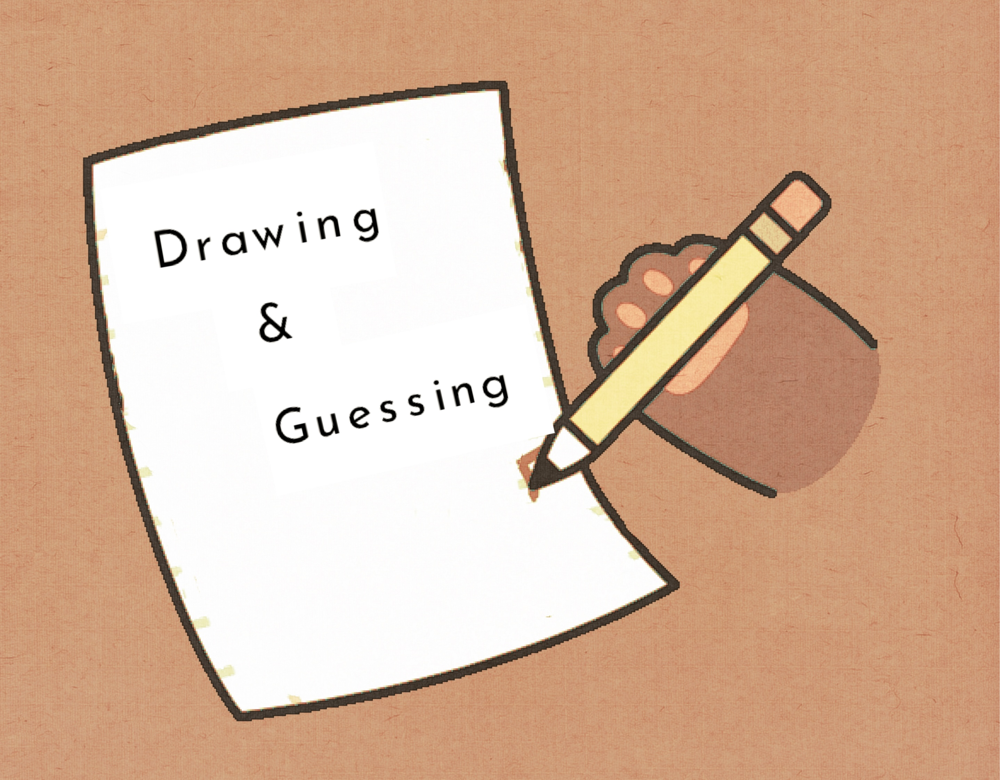

<h1 align="center">
  <br>
  
</h1>
<h1 align="center">SoPra FS23 - Drawing & Guessing</h1>
<h2 align="center"> :pencil: Introduction</h2>
Drawing & Guessing a social drawing application where players take turns drawing a picture of a given word, and other players compete to guess the word from the drawing. Users can  game is aimed at all age groups.

<h3 align="center">:round_pushpin: Goal</h3>
It is easy to play, and can motivate creative imaginations. It's a quick way to bond with strangers. Users can invite their newly formed group to a quick game for introductory.

<h3 align="center">:round_pushpin: Motivation</h3>

## :book: Table of content

- [Technologies](#technologies)
- [High-level components](#high-level-components)
- [Launch & Deployment](#launch-deployment)
- [Illustrations](#illustrations)
- [Roadmap](#roadmap)
- [Contributions](#contributions)
- [License](#license)

## Technologies

- NPM
- React
- ES6
- Canvas

## High level components

### Registered Users

The user can register and login into an account.

### Lobby

The user can view a public lobby, find existing waiting rooms and select one to join.

### Game

The user can play our game with friends.
<a name="launch-deployment"/>

## Launch & Deployment

**Installation**
To clone and run this application, you'll need [Git](https://git-scm.com), [Node.js 16.x](https://nodejs.org/en/download/), [NPM](https://www.npmjs.com/) installed on your computer.

Get the [server](https://github.com/sopra-fs23-group-19/sopra-fs23-group-19-server) and the [client](https://github.com/sopra-fs23-group-19/sopra-fs23-group-19-client/) repository from GitHub.

```bash
$ git clone https://github.com/sopra-fs23-group-19/sopra-fs23-group-19-client.git
```

To install required packages, please run the following command line.

```bash
npm install
```

To develop locally on your machine, just run the following command line:

```bash
npm run dev
```

## Illustrations

### Register and Login


Users can try to login with existed accounts or create a new one in login/register page.
### Welcome Page


There would be an animated guide of the game in the welcome page.
### Header


Users can get an intuitive page guide in the header.
- :Lobby Page: Get all non-full rooms or create a new game room.
- :Leaderboard Page: List the best 10 players.
- :Profile Page: Edit the personal information.
- :Friends Page: Get the list of friends and search a friend with his/her username.
- :Notification Page: Handle the friend or game invite requests.
- :Rules Page: Descripstions of game and rules.

Also, just below the header there is an icon for controlling the on/off status of the background music, this would remain in every other pages.

### Game


User can set the name of the game room and choose the mode.


Users can see the usernames of players who enter the game room and can invite their friends to play together.


The drawing player has 60s to draw a picture to describe the word chosen from the three given ones and the guessing player can see the live drawing board.


The Guessing player can guess the word and all players can download the picture result.


After each turn, there is a short conclusion of each player’s score.


After every player becomes the drawing player once, the game ends. And the final leaderboard will show to all players.

## Roadmap

- :white_check_mark: Allow touch input.
- :negative_squared_cross_mark: Allow guessing players guess multiple times.
- :negative_squared_cross_mark: Allow live chat during the game.
- :negative_squared_cross_mark: Configurable setting of game rounds and word difficulty.
- :negative_squared_cross_mark: Display the guessing players hit or incorrectly answer in real-time.
- :negative_squared_cross_mark: Better user interface.
- :negative_squared_cross_mark: Optional re-match after a game ends.

## Contributions

### Authors

| Name        |
| ----------- |
| Runze Li    |
| Jingjing Li |
| Geyu Meng   |
| Manyi Wang  |
| Shiyu Ran   |

### Acknowledgement

- The client code is based on the [SoPra FS23 - Client Template](https://github.com/HASEL-UZH/sopra-fs23-template-client).
- Many thanks to **[Mete Polat](https://github.com/polatmete)** who helped us as a Tutor and Scrum Master during this SoPra project.

**Note**  
_The cartoon cat images are from GIPHY and all credit goes to the original artists._

## License
